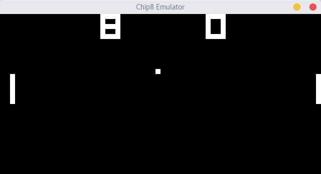

# Chip8

This repository contains a Chip8 emulator that is writtein in C.

# Required Libraries

To use this repository you need to have the `SDL2` library installed.

# How to use this Repository

First clone this repository:

`git clone https://github.com/DeterminedPanda/Chip8`

Then change your working directory into the repository:

`cd Chip8/`

Compile the repository:

`make`

Run the programm:

`./emulator`

done.

# Online Resources
[https://en.wikipedia.org/wiki/CHIP-8]

[http://www.multigesture.net/articles/how-to-write-an-emulator-chip-8-interpreter/]

[http://devernay.free.fr/hacks/chip8/C8TECH10.HTM]
