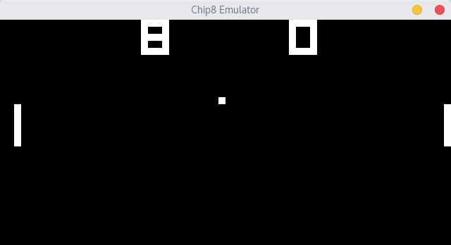

# Chip8

This repository contains a Chip8 emulator, that is written in C.

# Why?

I wanted to learn C and was interested in emulators, so I thought this would be a neat little project.
Keep in mind that this is my first project in C, so the code is probably ~~shit~~ improvable

# Required Libraries

To use this repository you need to have the `SDL2` library installed.

# How to use this Repository

first you need to clone this repository:

`[you@machine]$ git clone https://github.com/DeterminedPanda/Chip8`

then change your current working directory to the newly cloned repository:

`[you@machine]$ cd Chip8/`

after that you need to compile this project:

`[you@machine]$ make`

now you can run the program:

`[you@machine]$ ./emulator`

done.

# Used Resources
https://en.wikipedia.org/wiki/CHIP-8

http://www.multigesture.net/articles/how-to-write-an-emulator-chip-8-interpreter/

http://devernay.free.fr/hacks/chip8/C8TECH10.HTM
